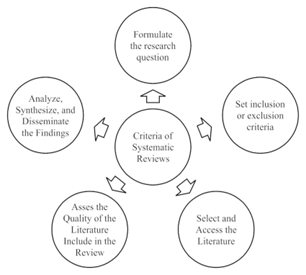

# Tipe-tipe Riset Sekunder

Analisis data sekunder adalah metode penelitian yang memungkinkan peneliti untuk mengembangkan pengetahuan baru dengan memanfaatkan data yang sudah ada. Data ini bisa berupa data kuantitatif, kualitatif, atau gabungan dari keduanya, yang digunakan untuk menjawab pertanyaan penelitian yang baru.

Data sekunder dapat berasal dari berbagai sumber, seperti:

-   Data yang dikumpulkan melalui penelitian asli (baik kuantitatif maupun kualitatif)

-   Data survei nasional

-   Data yang dikumpulkan untuk tujuan non-penelitian (misalnya, data rekam medis elektronik atau data pemantauan)

Data sekunder juga dapat memiliki berbagai bentuk, seperti data cross-sectional atau longitudinal, data geografis atau regional, data spesifik penyakit kronis, data pendidikan, dan lainnya. Peneliti yang menggunakan analisis data sekunder harus memiliki pemahaman yang mendalam tentang bidang yang mereka teliti untuk mengidentifikasi pertanyaan penelitian yang relevan, menemukan kumpulan data yang sesuai, dan menerapkan prinsip-prinsip penelitian yang sama dengan peneliti primer.

## Systematic Review

### Introduction to Systematic Review

Systematic review adalah metode penelitian yang menggunakan data sekunder untuk mensintesis semua bukti yang tersedia dan relevan. Tujuannya adalah untuk mengumpulkan dan menganalisis semua studi primer yang ada untuk menjawab pertanyaan penelitian yang spesifik. Systematic Review harus mengikuti metodologi yang transparan dan dapat direplikasi. Artinya, proses identifikasi studi dan kriteria inklusi atau eksklusi harus dijelaskan secara rinci. Selain itu, tinjauan sistematis tidak hanya merangkum temuan studi, tetapi juga harus mengevaluasi dan menilai kualitas metodologi studi yang ditinjau.

### Topic selection and planning

Sebagian besar systematic review membutuhkan waktu antara enam sampai delapan belas bulan untuk diselesaikan dan membutuhkan minimal tiga penulis untuk menyaring hasil pencarian secara independen. Setelah ditentukan bahwa systematic review adalah metodologi yang tepat untuk penelitian, dan ada waktu serta sumber daya yang cukup untuk melaksanakannya, peneliti melanjutkan untuk mengembangkan topik tinjauan mereka. Pada tahap ini, peneliti melakukan pencarian cakupan dalam database subjek yang relevan, pertama untuk memastikan bahwa tinjauan yang diusulkan unik dan memenuhi kebutuhan penelitian, dan kedua untuk mendapatkan gambaran umum tentang literatur yang ada, dan yang mungkin akan disertakan dalam tinjauan sistematis yang akan dilakukan. Setelah peneliti merasa yakin dengan topik yang dipilih, langkah selanjutnya adalah menyiapkan protokol yang menyatakan secara transparan metodologi yang akan digunakan dalam melakukan tinjauan.

Protokol adalah deskripsi dari tinjauan sistematis yang diusulkan, termasuk metode, dasar pemikiran tinjauan, dan langkah-langkah yang akan diambil untuk menghilangkan bias saat melakukan tinjauan. Sebagian besar protokol terdaftar di PROSPERO (2020). Panduan untuk membuat protokol dapat ditemukan di PRISMA-P (The PRISMA Group et al 2015), atau dengan mengikuti pelatihan online tentang protokol yang tersedia di Cochrane Library ([Cochrane Interactive Learning 2019](https://training.cochrane.org/interactivelearning/module-2-writing-review-protocol)).

### Reporting standards and structure

PRISMA (Preferred Reporting Items for Systematic Reviews and Meta-analysis) adalah standar minimum berbasis bukti yang harus dipenuhi dalam laporan systematic review dan meta-analisis. PRISMA checklist berfungsi sebagai panduan tentang isi apa saja yang perlu dilaporkan dan disertakan dalam versi final systematic review yang akan diterbitkan. Selain itu, PRISMA juga bermanfaat sebagai acuan pada tahap perencanaan penelitian.

### Search strategy

Search strategy dalam systematic review adalah cara utama untuk mengumpulkan data yang akan mendukung temuan tinjauan. Proses ini melibatkan penggunaan beberapa sinonim untuk setiap tema topik systematic review. Pencarian dilakukan di berbagai bagian ( judul dan abstrak) dengan menggunakan istilah bebas dan kosakata terkontrol yang terdapat dalam tesaurus basis data. Istilah-istilah ini kemudian digabungkan menggunakan operator Boolean AND, OR, dan NOT untuk memastikan hasil pencarian yang relevan dan komprehensif.

Dalam proses pembuatan systematic review, peneliti perlu menyeleksi judul dan abstrak artikel untuk menentukan apakah artikel tersebut memenuhi kriteria inklusi yang telah ditentukan sebelumnya dalam protokol penelitian. Proses seleksi ini idealnya dilakukan secara independen oleh setidaknya dua orang peneliti. Tahap pertama adalah menyeleksi judul dan abstrak. Artikel yang lolos seleksi judul dan abstrak akan masuk ke tahap selanjutnya, yaitu skrining teks lengkap. Skrining teks lengkap dilakukan untuk artikel-artikel yang belum memenuhi semua kriteria inklusi berdasarkan informasi dari judul dan abstrak. Untuk mempermudah proses skrining, peneliti dapat menggunakan perangkat lunak referensi seperti Endnote, EndnoteWeb, Mendeley, Zotero, Covidence, atau Rayyan.

### Critical appraisal tools

Studi yang termasuk dalam systematic review harus dinilai kualitasnya. Meskipun studi berkualitas rendah tidak boleh dieksklusikan bila memenuhi kriteria inklusi, systematic review harus menjelaskan bahwa semua penelitian yang disertakan telah dinilai menggunakan prinsip-prinsip penilaian kritis yang konsisten. Hasil penilaian ini juga harus disertakan dalam tinjauan. Jika tinjauan sistematis hanya mencakup artikel jurnal yang telah ditinjau oleh rekan sejawat dan dipublikasikan, maka daftar periksa dari CASP (Critical Appraisal Skills Programme), Centre for Evidence-Based Medicine, SIGN (Scottish Intercollegiate Guidelines Network), atau Joanna Briggs Institute dapat digunakan. Selain itu, terdapat alat penilaian risiko bias seperti RoBiS untuk mengevaluasi tinjauan sistematis, dan RoB 2 untuk mengevaluasi uji coba terkontrol secara acak.

## Literature Review

Literature review adalah ringkasan objektif dan analisis kritis yang cermat dari literatur penelitian dan non-penelitian yang relevan dengan isu, area penelitian, atau teori tertentu. Tujuannya adalah untuk memberikan deskripsi, ringkasan, dan evaluasi kritis terhadap karya-karya tersebut. Literature review dirancang untuk memberikan gambaran umum tentang sumber yang telah dieksplorasi saat meneliti topik tertentu dan untuk menunjukkan kepada pembaca bagaimana penelitian Anda dapat menjadi  justifikasi untuk penelitian di masa depan.

## Meta-Analysis

Meta-analisis adalah metode statistik yang digunakan untuk menggabungkan hasil dari banyak penelitian untuk memberikan ringkasan yang komprehensif tentang pengetahuan dalam suatu bidang penelitian. Dengan menggabungkan temuan dari studi-studi individual, meta-analisis memungkinkan peneliti untuk menarik kesimpulan yang lebih akurat dan kuat secara statistik mengenai hubungan antar variabel.

Dalam meta-analisis, peneliti menghitung "Effect Size" dari setiap studi, yang menunjukkan arah dan kekuatan hubungan antara dua variabel. Ukuran efek ini merupakan metrik standar yang dapat dibandingkan di berbagai studi. Informasi dari setiap studi diekstraksi dan dimasukkan ke dalam basis data meta-analisis untuk menghitung ukuran efek masing-masing studi. Selanjutnya, semua ukuran efek dari setiap studi digabungkan untuk menentukan kekuatan dan arah asosiasi hubungan antar variabel pada tingkat agregat.

## Scoping Review

Scoping review memiliki kemiripan dengan tinjauan sistematis, tetapi keduanya memiliki tujuan yang berbeda. Scoping review lebih menekankan pada identifikasi sifat, jumlah, atau karakteristik studi daripada melakukan sintesis data yang telah dipublikasikan. Scoping review sangat berguna untuk meneliti bukti-bukti yang masih belum jelas atau ketika pertanyaan penelitian yang lebih spesifik belum dapat dirumuskan dengan baik. Namun, karena sifatnya yang lebih luas dan heterogen, scoping review mungkin memiliki risiko bias yang lebih tinggi dibandingkan dengan tinjauan sistematis.

**Referensi**

Michelle M. Kelly, Tasha Martin-Peters, Jessica Strohm Farber. Secondary Data Analysis: Using existing data to answer new questions. Journal of Pediatric Health Care. Volume 38, Issue 4. 2024. Pages 615-618. ISSN 0891-5245. <https://doi.org/10.1016/j.pedhc.2024.03.005>.

Wickham RJ. Secondary Analysis Research. J Adv Pract Oncol. 2019 May-Jun;10(4):395-400. doi: 10.6004/jadpro.2019.10.4.7. Epub 2019 Mar 1. PMID: 33343987; PMCID: PMC7520737.

Phillips V, Barker E. Systematic reviews: Structure, form and content. Journal of Perioperative Practice. 2021;31(9):349-353. <doi:10.1177/1750458921994693>

Ramdhani, Abdullah & Ramdhani, Muhammad & Amin, Abdusy. (2014). Writing a Literature Review Research Paper: A step-by-step approach. International Journal of Basic and Applied Science. 3. 47-56.

Hernandez AV, Marti KM, Roman YM. Meta-Analysis. Chest. 2020 Jul;158(1S):S97-S102. doi: 10.1016/j.chest.2020.03.003. PMID: 32658658.

Paul, J., &  Barari, M. (2022). Meta-analysis and traditional systematic literature reviews—What, why, when, where, and how? Psychology & Marketing, 39, 1099–1115. <https://doi.org/10.1002/mar.21657>
