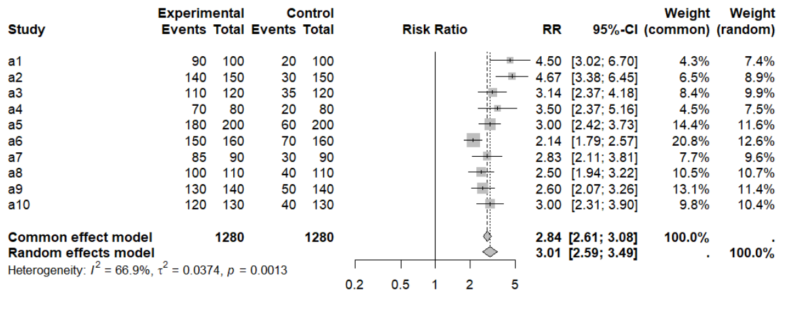
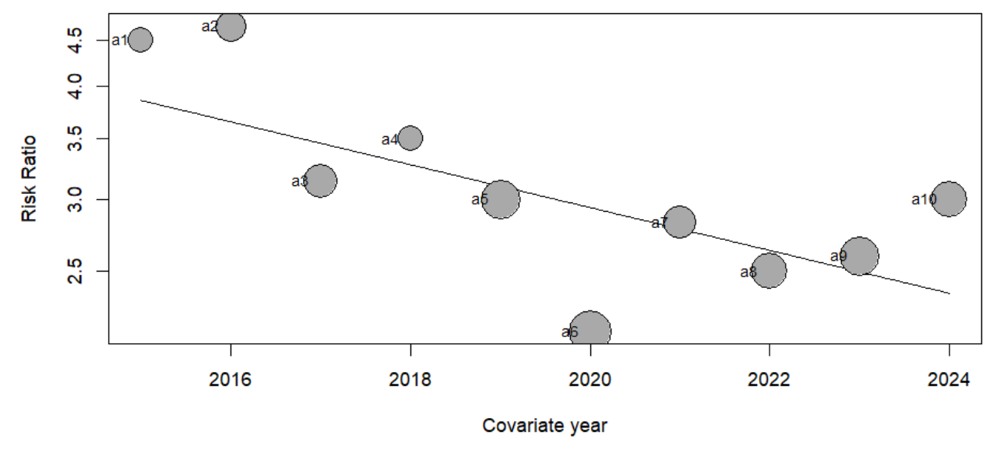

# Meta Regresi

Meta-regresi merupakan perluasan dari analisis sub kelompok. Berbeda
dengan analisis sub kelompok yang hanya melihat karakteristik kategori,
meta-regresi dapat menganalisis karakteristik kategori maupun kontinu.
Selain itu, metode ini bisa menginvestigasi beberapa faktor sekaligus
untuk melihat bagaimana faktor-faktor tersebut mempengaruhi efek
intervensi. Namun, analisis ini membutuhkan jumlah studi yang cukup
banyak, dan jika jumlah studi kurang dari sepuluh, meta-regresi
sebaiknya tidak digunakan.

## Meta Regresi vs Regresi Sederhana

Meta-regresi adalah metode analisis yang digunakan untuk memahami
bagaimana karakteristik suatu studi mempengaruhi hasil intervensi dalam
sebuah meta-analisis. Sederhananya, ini mirip dengan regresi biasa, di
mana kita mencoba melihat hubungan antara satu atau lebih faktor dengan
hasil tertentu. Dalam meta-regresi, hasil yang kita analisis biasanya
berupa ukuran efek intervensi, seperti perbedaan rata-rata atau rasio
risiko. Sementara itu, faktor yang kita teliti adalah karakteristik
studi yang bisa mempengaruhi hasil intervensi, misalnya metode
penelitian yang digunakan atau karakteristik peserta dalam studi
tersebut, yang dapat juga disebut sebagai kovariat.

Ada beberapa perbedaan penting antara meta-regresi dan regresi biasa.
Pertama, dalam meta-regresi, studi yang memiliki lebih banyak data dan
hasil yang lebih akurat akan memberikan pengaruh lebih besar
dibandingkan studi yang lebih kecil. Kedua, meta-regresi
mempertimbangkan perbedaan yang tidak bisa dijelaskan hanya dengan
faktor yang dianalisis, sehingga menggunakan pendekatan yang disebut
“random effect model” untuk mengakomodasi variasi tersebut.

## Hasil Meta Regresi

Koefisien regresi yang diperoleh dari analisis meta-regresi akan
menjelaskan bagaimana variabel hasil (efek intervensi) berubah dengan
peningkatan satu unit pada variabel penjelas (pengubah efek
potensial/kovariat). Signifikansi statistik koefisien regresi merupakan
pengujian apakah terdapat hubungan linear antara efek intervensi dan
variabel penjelas. Koefisien regresi akan memperkirakan bagaimana efek
intervensi di setiap sub kelompok berbeda dari sub kelompok referensi
yang ditentukan. Nilai P dari setiap koefisien regresi akan menunjukkan
kekuatan bukti terhadap hipotesis nol bahwa karakteristik tersebut tidak
terkait dengan efek intervensi. Meta-regresi dapat dilakukan menggunakan
makro "metareg" yang tersedia dalam paket statistik Stata, atau
menggunakan paket “meta” atau "metafor" untuk R, serta paket dan
software lainnya.

## Meta Regresi pada R

Paket meta dalam R memiliki fungsi yang disebut metareg, yang digunakan
untuk melakukan meta-regresi. Fungsi ini cukup sederhana karena hanya
membutuhkan objek meta-analisis dari paket meta dan nama kovariat yang
ingin dianalisis. Dalam contoh ini, kita ingin melihat apakah tahun
publikasi suatu studi dapat digunakan untuk memprediksi ukuran efeknya.
Untuk itu, kita akan menggunakan objek meta-analisis m.gen dengan data
dummy bernama
[metabin](https://docs.google.com/spreadsheets/d/1rMy3upWNEntpVm_6xFa_SGMVoCnbFMah8jRQ1L45Fko/edit?gid=0#gid=0).

### Import Data & Membuat Meta Analisis

Sama seperti bagian sebelumnya pada Meta Analisis untuk data biner, data
yang dibutuhkan sudah dimasukkan ke dalam excel (penjelasan lebih
lengkap mengenai meta analisis data biner dapat dibuka pada bagian
terkait).

Setelah mengunduh data dummy berjudul “metabin”, buka RStudio klik
pilihan “Import Dataset” pada menu “Environment”. Kemudian, klik “From
Excel”. Kemudian, klik “Browse” pada ujung kanan atas. Setelah itu,
pilih file yang diinginkan. Lalu, klik “Import”".

1.  Install package: hanya perlu dilakukan satu kali saja, bila sudah
    pernah dilakukan, maka hanya perlu melakukan pemanggilan package

    ``` r
    install.package(c(“readx1”,"meta"))
    ```

2.  Pemanggilan package

    ``` r
    library(readx1) 
    library(meta)
    ```

3.  Melakukan meta-analisis (dalam hal ini metabin: OR/RR)

    ``` r
    m.bin <- metabin( event.e = metabin$eventint,n.e = metabin$nint, event.c = metabin$eventcont,n.c = metabin$ncont, studlab = metabin$author, year = metabin$year, data = metabin, sm = "RR", method = "Inverse", common = TRUE, method.tau = "PM")
    ```

4.  Membuat rangkuman hasil

    ``` r
    summary(m.bin)
    ```

```         
       RR           95%-CI %W(common) %W(random)
a1  4.5000 [3.0243; 6.6958]        4.3        7.4
a2  4.6667 [3.3789; 6.4453]        6.5        8.9
a3  3.1429 [2.3658; 4.1751]        8.4        9.9
a4  3.5000 [2.3733; 5.1616]        4.5        7.5
a5  3.0000 [2.4156; 3.7258]       14.4       11.6
a6  2.1429 [1.7895; 2.5660]       20.8       12.6
a7  2.8333 [2.1065; 3.8110]        7.7        9.6
a8  2.5000 [1.9389; 3.2235]       10.5       10.7
a9  2.6000 [2.0721; 3.2624]       13.1       11.4
a10 3.0000 [2.3072; 3.9008]        9.8       10.4

Number of studies: k = 10
Number of observations: o = 2560 (o.e = 1280, o.c = 1280)
Number of events: e = 1570

                         RR           95%-CI     z  p-value
Common effect model  2.8379 [2.6138; 3.0812] 24.86 < 0.0001
Random effects model 3.0061 [2.5900; 3.4891] 14.48 < 0.0001

Quantifying heterogeneity (with 95%-CIs):
 tau^2 = 0.0374 [0.0072; 0.1777]; tau = 0.1935 [0.0850; 0.4215]
 I^2 = 66.9% [35.5%; 83.0%]; H = 1.74 [1.25; 2.43]

Test of heterogeneity:
     Q d.f. p-value
 27.19    9  0.0013

Details of meta-analysis methods:
- Inverse variance method
- Paule-Mandel estimator for tau^2
- Q-Profile method for confidence interval of tau^2 and tau
- Calculation of I^2 based on Q
```

5.  Membuat forest plot

    ``` r
    forest(m.bin)
    ```

    

6.  Melakukan Meta Regresi

    Untungnya, dalam kumpulan data metreg, sudah ada variabel yang
    menyimpan informasi tahun publikasi setiap studi. Jadi, kita bisa
    langsung memanggilnya dengan perintah berikut:

    ``` r
    year <- m.bin$data$year 
    ```

    Sekarang, kita sudah memiliki semua informasi yang dibutuhkan untuk
    menjalankan meta-regresi. Dalam fungsi metareg, kita cukup
    memasukkan nama objek meta-analisis kita, yaitu m.gen, sebagai
    argumen pertama. Lalu, kita tambahkan nama variabel prediktor yang
    ingin kita analisis, yaitu year, sebagai argumen kedua. Hasil dari
    meta-regresi ini akan kita simpan dan buka dalam objek bernama
    m.gen.reg.year dengan perintah berikut:

    ``` r
    m.gen.reg.year <- metareg(m.bin, ~year)
    summary(m.gen.reg.year)
    ```

```         
Mixed-Effects Model (k = 10; tau^2 estimator: PM)

  logLik  deviance       AIC       BIC      AICc   
  3.2964   14.2999   -0.5928    0.3150    3.4072   

tau^2 (estimated amount of residual heterogeneity):     0.0163 (SE = 0.0179)
tau (square root of estimated tau^2 value):             0.1276
I^2 (residual heterogeneity / unaccounted variability): 47.74%
H^2 (unaccounted variability / sampling variability):   1.91
R^2 (amount of heterogeneity accounted for):            56.50%

Test for Residual Heterogeneity:
QE(df = 8) = 18.1520, p-val = 0.0201

Test of Moderators (coefficient 2):
QM(df = 1) = 6.1396, p-val = 0.0132

Model Results:

         estimate       se     zval    pval    ci.lb     ci.ub    
intrcpt  111.1706  44.4289   2.5022  0.0123  24.0915  198.2497  * 
year      -0.0545   0.0220  -2.4778  0.0132  -0.0976   -0.0114  * 


Signif. codes:  0 ‘***’ 0.001 ‘**’ 0.01 ‘*’ 0.05 ‘.’ 0.1 ‘ ’ 1
```

Sekarang, kita telah menyelesaikan model dan mendapatkan beberapa hasil
yang bisa kita pahami. Model ini menggunakan data dari 10 studi dan
menghitung heterogenitas dengan metode Penalized Maximization (PM).
Model campuran ini digunakan karena kita ingin melihat pengaruh dari
efek tetap (fixed effect) dan efek acak (random effect) secara
bersamaan. Heterogenitas residual, yang mengukur seberapa besar
variabilitas yang belum dapat dijelaskan, ditemukan sebesar 0.0163,
dengan standar error 0.0179. Ini menunjukkan bahwa ada sedikit variasi
yang tidak bisa dijelaskan antara hasil studi. Kemudian, tau² (yang
menunjukkan sebaran heterogenitas) memiliki nilai 0.1276, yang artinya
ada sedikit perbedaan antara studi-studi dalam hal ukuran efeknya.

Angka I² sebesar 47.74% menunjukkan bahwa hampir setengah dari variasi
yang ada disebabkan oleh perbedaan antar studi yang tidak dapat
dijelaskan. Ini menunjukkan adanya heterogenitas moderat. Sedangkan, H²
sebesar 1.91 menunjukkan bahwa setelah memperhitungkan heterogenitas,
variasi dalam ukuran efek lebih besar 1.91 kali dibandingkan dengan
variasi yang diharapkan hanya dari kesalahan pengambilan sampel. Namun,
model ini juga menjelaskan lebih dari separuh heterogenitas yang ada,
yaitu sebesar 56.50%, yang berarti bahwa moderator yang kita gunakan,
dalam hal ini tahun publikasi, dapat menjelaskan lebih dari setengah
perbedaan yang terlihat dalam ukuran efek.

Uji residual heterogenitas menunjukkan hasil yang signifikan dengan
p-value 0.0201, yang berarti masih ada variasi yang tidak bisa
dijelaskan setelah mempertimbangkan moderator. Sedangkan uji untuk
moderator menunjukkan bahwa tahun publikasi memang mempengaruhi ukuran
efek, dengan p-value 0.0132 yang signifikan. Untuk hasil model, kita
menemukan bahwa interceptnya adalah 111.1706, yang bisa diartikan bahwa
jika tahun adalah nol, ukuran efeknya adalah sekitar 111.17. Meskipun
ini mungkin tidak realistis, ini berfungsi sebagai titik dasar.

Sedangkan untuk moderator tahun, koefisien yang didapat adalah -0.0545,
yang berarti setiap penambahan tahun akan menurunkan ukuran efek sebesar
0.0545. Nilai p sebesar 0.0132 mengindikasikan bahwa pengaruh tahun
terhadap ukuran efek ini signifikan. Kesimpulannya, model ini
menunjukkan bahwa meskipun ada heterogenitas residual moderat (I² =
47.74%), lebih dari setengah heterogenitas ini (56.50%) dapat dijelaskan
oleh tahun publikasi. Selain itu, baik intercept maupun pengaruh tahun
terhadap ukuran efek menunjukkan hasil yang signifikan, dengan tren
bahwa ukuran efek cenderung menurun seiring berjalannya waktu.

## Visualisasi Meta Regresi

Paket meta dalam R juga memungkinkan kita untuk memvisualisasikan hasil
meta-regresi dengan menggunakan fungsi bubble. Fungsi ini akan
menghasilkan bubble plot, yang menampilkan kemiringan regresi yang
diperkirakan serta ukuran efek dari masing-masing studi. Dalam plot ini,
setiap studi direpresentasikan oleh gelembung dengan ukuran yang
berbeda. Semakin besar gelembung, semakin besar bobot studi tersebut
dalam analisis meta-regresi. Untuk membuat bubble plot, kita cukup
memasukkan objek meta-regresi ke dalam fungsi bubble. Jika kita ingin
menampilkan label studi pada plot, kita bisa menambahkan argumen studlab
= TRUE.

``` R
bubble(m.gen.reg.year, studlab = TRUE)
```

{width="424"}

**Referensi**

Harrer, M., Cuijpers, P., Furukawa, T. A., & Ebert, D. D. (2021). Doing
Meta-Analysis with R. 9781003107347.
<https://doi.org/10.1201/9781003107347>

Geissbühler, M., Hincapié, C.A., Aghlmandi, S., Zwahlen, M., Jüni, P.
and da Costa, B.R., 2021. Most published meta-regression analyses based
on aggregate data suffer from methodological pitfalls: a
meta-epidemiological study. BMC Medical research methodology, 21(1),
pp.1-9.

Chapter 10: Analysing data and undertaking meta-analyses. (2024).
Cochrane.org.
<https://training.cochrane.org/handbook/current/chapter-10#_Ref180060159>
