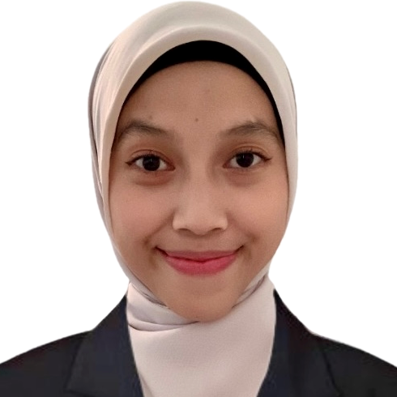

# R-Handbook Mini Series

## Foreword

{style="float:left; padding:0; margin:0; border:none" width="160"}

::: {style="color: white"}
**.**
:::

**Tiara Maritza Ermizal**

*Secretary of Research*

AMSA-Indonesia 2024/2025

::: {style="color: white"}
.
:::

*Hi*, *People of Tomorrow*!

Perkembangan riset yang pesat merupakan fondasi utama dalam kemajuan dunia. Sebagai mahasiswa kedokteran, penting bagi kita untuk bisa beradaptasi dengan perubahan dan menambah wawasan mengenai berbagai macam pendekatan yang dapat kita ambil dalam menyelesaikan masalah melalui riset. Sejalan dengan hal ini, AMSA-Indonesia dengan bangga mempersembahkan R*‑Handbook Mini Series*.

R-*Handbook Mini Series* adalah fasilitas yang disediakan oleh AMSA-Indonesia untuk member dalam upaya memperdalam pengetahuan member mengenai riset. R-*Handbook Mini Series* melengkapi dan memperbaharui konten yang sebelumnya sudah dikemas dengan baik pada R-*Handbook* AMSA-Indonesia. Pembaca dapat menemukan topik riset spesifik dan praktis, seperti analisis statistik lanjut yang dapat dimanfaatkan di riset bidang kedokteran.

Di akhir kata, saya mengucapkan terima kasih untuk *Research Team* AMSA-Indonesia 2024/2025 yang berperan besar dalam terbentuknya R-*Handbook Mini Series* ini. Saya berharap *member* AMSA-Indonesia dapat membaca dan mengeksplorasi perkembangan metode riset serta mengaplikasikan langkah-langkah dalam pembuatan riset. Semoga inisiatif ini menjadi langkah awal yang berarti bagi terciptanya karya riset yang bermakna dan berdampak.

"Unified in Purpose, Collaborating for Change"

Viva AMSA!

## Contributors

+:------------------------------------------------------------:+:------------------------------------------------------------:+
|  |  |
|                                                              |                                                              |
| **Widya Khairunisa**                                         | **Nurul Fathiah Azzahra**                                    |
|                                                              |                                                              |
| *Research Team District* 1                                   | *Research Team District* 1                                   |
+--------------------------------------------------------------+--------------------------------------------------------------+

+:--------------------------------------------------------------:+:-----------------------------------------:+:------------------------------------------------------------:+
|  | -01.png){width="134"} |  |
|                                                                |                                           |                                                              |
| **Robby Malik Chandra S.**                                     | **Joyceline Chika Tanely**                | **Maria Sri Crishnatalia W.**                                |
|                                                                |                                           |                                                              |
| *Research Team District* 2                                     | *Research Team District* 2                | *Research Team District* 3                                   |
+----------------------------------------------------------------+-------------------------------------------+--------------------------------------------------------------+

+:---------------------------------------------------------------:+:-----------------------------------------------------------:+:---------------------------------------------------------------:+
|  |  |  |
|                                                                 |                                                             |                                                                 |
| **Malika Syaharani**                                            | **Michael Purnama**                                         | **Al Hafiez Ariouso**                                           |
|                                                                 |                                                             |                                                                 |
| *Research Team District* 4                                      | *Research Team District* 5                                  | *Research Team District* 5                                      |
+-----------------------------------------------------------------+-------------------------------------------------------------+-----------------------------------------------------------------+

+:--------------------------------------------------------------:+:-------------------------------------------------------------:+
|  |  |
|                                                                |                                                               |
| **Putrina Happy Ughita**                                       | **Arjuna Datu Mangontan**                                     |
|                                                                |                                                               |
| *Research Team District* 6                                     | *Research Team District* 6                                    |
+----------------------------------------------------------------+---------------------------------------------------------------+
